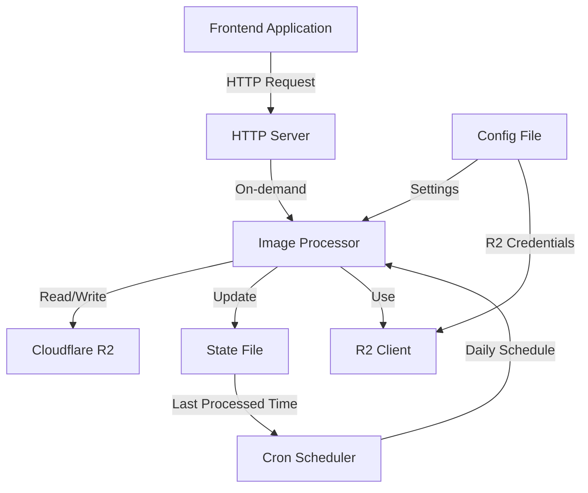
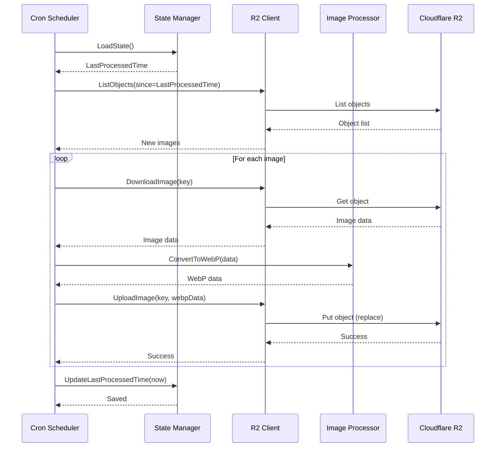
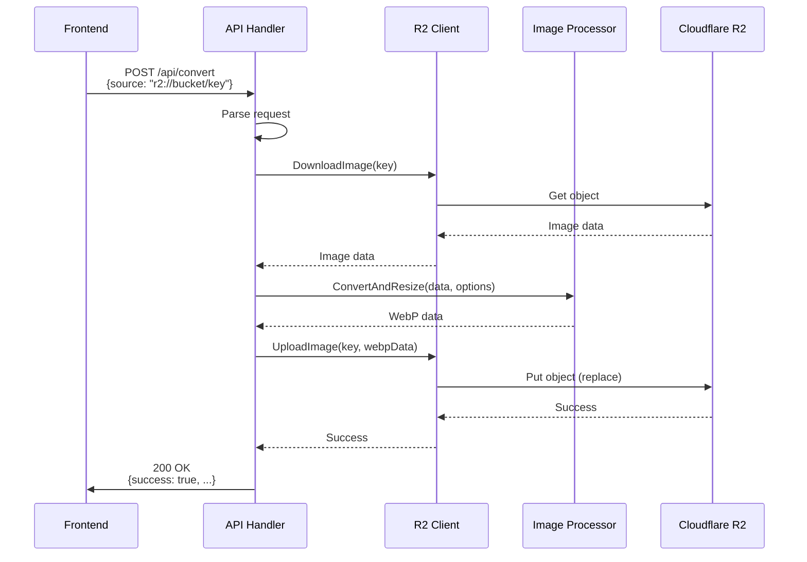
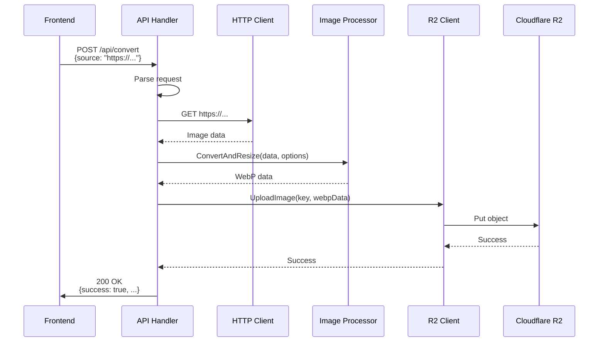

# 아키텍처 문서

Image Converting Server의 시스템 아키텍처, 컴포넌트 설계, 데이터 흐름을 설명합니다.

## 시스템 아키텍처 개요



## 전체 시스템 구조

```
┌─────────────────────────────────────────────────────────┐
│                    Image Converting Server               │
├─────────────────────────────────────────────────────────┤
│                                                          │
│  ┌──────────────┐         ┌──────────────┐             │
│  │ HTTP Server  │         │ Cron Scheduler│            │
│  │  (main.go)   │         │  (cron/job.go)│            │
│  └──────┬───────┘         └──────┬───────┘             │
│         │                        │                      │
│         │                        │                      │
│  ┌──────▼───────────────────────▼──────┐             │
│  │         Image Processor               │             │
│  │      (processor/converter.go)         │             │
│  └──────┬───────────────────────┬───────┘             │
│         │                       │                      │
│  ┌──────▼──────┐      ┌────────▼────────┐            │
│  │ R2 Client   │      │  State Manager  │            │
│  │(r2/client.go)│      │ (state/state.go)│            │
│  └──────┬──────┘      └─────────────────┘            │
│         │                                              │
└─────────┼──────────────────────────────────────────────┘
          │
          ▼
┌─────────────────────┐
│  Cloudflare R2      │
│  (Object Storage)    │
└─────────────────────┘
```

## 컴포넌트 상세 설명

### 1. 설정 관리 (config/)

**역할**: YAML 설정 파일을 로드하고 검증하여 다른 컴포넌트에 제공

**주요 구조체**:
```go
type Config struct {
    R2         R2Config
    Conversion ConversionConfig
    Resize     ResizeConfig
    Cron       CronConfig
}
```

**책임**:
- 설정 파일 로드 및 파싱
- 설정 값 검증
- 기본값 제공
- 환경 변수 지원 (선택적)

**의존성**: 없음

**사용처**: 모든 컴포넌트

---

### 2. R2 클라이언트 (r2/)

**역할**: Cloudflare R2와의 모든 상호작용을 담당

**주요 함수**:
- `NewClient(config)` - R2 클라이언트 초기화
- `DownloadImage(key)` - 이미지 다운로드
- `UploadImage(key, data)` - 이미지 업로드
- `ListObjects(since)` - 마지막 수정 시간 이후 객체 목록 조회

**책임**:
- AWS SDK v2를 사용한 R2 접속
- 이미지 다운로드/업로드
- 객체 목록 조회 및 필터링
- 에러 처리 및 재시도 로직

**의존성**: 
- `config/` - R2 접속 정보

**사용처**: 
- `processor/` - 이미지 다운로드/업로드
- `cron/` - 객체 목록 조회

---

### 3. 이미지 프로세서 (processor/)

**역할**: 이미지 변환 및 리사이징 처리

**주요 함수**:
- `ConvertToWebP(imageData, quality)` - WebP 변환
- `ResizeImage(imageData, width, height)` - 리사이징
- `ConvertAndResize(imageData, options)` - 변환 + 리사이징 통합

**책임**:
- 이미지 포맷 감지
- WebP 인코딩
- 이미지 리사이징 (비율 유지 옵션)
- 메모리 효율적인 처리

**의존성**: 없음 (독립적으로 테스트 가능)

**사용처**:
- `api/` - 온디맨드 변환
- `cron/` - 자동 변환

---

### 4. 상태 관리 (state/)

**역할**: 크론 잡의 마지막 실행 시간을 추적하여 증분 처리 지원

**주요 함수**:
- `LoadState()` - 상태 로드
- `SaveState(state)` - 상태 저장
- `UpdateLastProcessedTime(time)` - 마지막 처리 시간 업데이트

**책임**:
- JSON 파일 기반 상태 저장
- 마지막 처리 시간 추적
- 파일 없을 때 초기화

**의존성**: 없음

**사용처**:
- `cron/` - 증분 처리 로직

---

### 5. 크론 잡 (cron/)

**역할**: 일일 스케줄로 R2의 이미지를 자동 변환

**주요 함수**:
- `NewJob(config, r2Client, processor, stateManager)` - 크론 잡 초기화
- `ProcessImages()` - 이미지 처리 실행
- `Start()` - 크론 스케줄러 시작

**책임**:
- 스케줄러 초기화 및 등록
- 마지막 처리 시간 이후 새 이미지 조회
- 각 이미지 변환 처리
- 상태 업데이트
- 중복 실행 방지

**의존성**:
- `config/` - 크론 스케줄 설정
- `r2/` - 이미지 목록 조회 및 업로드
- `processor/` - 이미지 변환
- `state/` - 마지막 처리 시간 추적

**사용처**:
- `main.go` - 서버 시작 시 등록

---

### 6. API 핸들러 (api/)

**역할**: HTTP 요청을 처리하여 온디맨드 이미지 변환 제공

**주요 함수**:
- `ConvertHandler(w, r)` - 변환 요청 처리
- `HealthHandler(w, r)` - 헬스 체크

**책임**:
- HTTP 요청 파싱
- 소스 타입 감지 (R2 키 vs URL)
- 리사이징 파라미터 파싱
- 이미지 변환 요청 처리
- HTTP 응답 생성

**의존성**:
- `config/` - 설정 정보
- `r2/` - 이미지 다운로드/업로드
- `processor/` - 이미지 변환

**사용처**:
- `main.go` - HTTP 라우터에 등록

---

### 7. 메인 서버 (main.go)

**역할**: 모든 컴포넌트를 통합하여 서버를 시작

**책임**:
- 설정 로드
- 모든 컴포넌트 초기화
- HTTP 라우터 설정
- 크론 스케줄러 등록
- 서버 시작 및 Graceful shutdown

**의존성**: 모든 컴포넌트

---

## 데이터 흐름

### 시나리오 1: 크론 잡 실행 (자동 변환)



### 시나리오 2: API 요청 (온디맨드 변환)



### 시나리오 3: 외부 URL 변환



---

## 의존성 관계

```
main.go
├── config/
│   └── (독립적)
├── r2/
│   └── config/
├── processor/
│   └── (독립적)
├── state/
│   └── (독립적)
├── cron/
│   ├── config/
│   ├── r2/
│   ├── processor/
│   └── state/
└── api/
    ├── config/
    ├── r2/
    └── processor/
```

### 의존성 그래프

```
config ──┐
         │
r2 ──────┼──> cron
         │
processor┼──> cron
         │    │
         │    └──> api
         │
state ───┘
         │
         └──> main.go
```

---

## 파일 구조

```
image-converting-server/
├── main.go                 # 서버 진입점
├── config/
│   ├── config.go          # 설정 구조체 및 로더
│   └── config.yaml        # 설정 파일 예시
├── r2/
│   └── client.go          # R2 클라이언트
├── processor/
│   └── converter.go       # 이미지 변환/리사이징
├── cron/
│   └── job.go             # 크론 잡 실행
├── api/
│   └── handlers.go        # HTTP 핸들러
└── state/
    └── state.go           # 상태 관리
```

---

## 확장 가능성

### 향후 추가 가능한 기능

1. **인증/인가**
   - API 키 기반 인증
   - JWT 토큰 인증

2. **배치 처리**
   - 여러 이미지를 한 번에 변환
   - 비동기 처리 및 작업 큐

3. **다양한 출력 포맷**
   - AVIF 변환
   - JPEG XL 변환

4. **이미지 최적화 옵션**
   - 품질 조정
   - 메타데이터 제거 옵션

5. **모니터링 및 메트릭**
   - 처리된 이미지 수 추적
   - 처리 시간 메트릭
   - 에러율 모니터링

6. **캐싱**
   - 이미 변환된 이미지 캐싱
   - Redis 또는 메모리 캐시

---

## 제약사항

1. **단일 서버 실행**
   - 현재는 단일 서버 인스턴스만 지원
   - 분산 환경에서는 상태 파일 공유 필요

2. **동기 처리**
   - API 요청은 동기적으로 처리
   - 큰 이미지의 경우 응답 시간이 길어질 수 있음

3. **에러 복구**
   - 실패한 이미지는 수동으로 재처리 필요
   - 자동 재시도는 현재 미지원

4. **리소스 제한**
   - 메모리 사용량은 이미지 크기에 비례
   - 동시 처리 수 제한 없음 (필요시 추가)

---

## 성능 고려사항

1. **메모리 관리**
   - 큰 이미지는 스트리밍 방식으로 처리 고려
   - 변환 후 즉시 메모리 해제

2. **병렬 처리**
   - 크론 잡에서 여러 이미지를 병렬로 처리 가능
   - Go routine 사용

3. **캐싱 전략**
   - 이미 변환된 이미지는 재변환하지 않도록 체크
   - ETag 또는 해시 기반 변경 감지

---

## 참고 문서

- [IMPLEMENTATION.md](./IMPLEMENTATION.md) - 구현 순서 가이드
- [API.md](./API.md) - API 명세서
- [CONFIG.md](./CONFIG.md) - 설정 가이드
- [CRON.md](./CRON.md) - 크론 잡 문서
