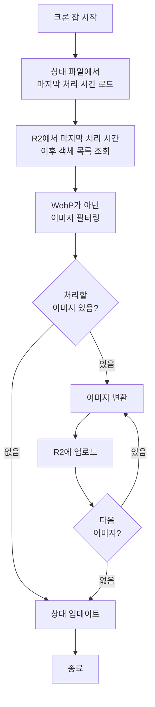

# 크론 잡 문서

Image Converting Server의 크론 잡 동작 방식, 스케줄링, 증분 처리 로직을 설명합니다.

## 개요

크론 잡은 설정된 스케줄에 따라 자동으로 R2 버킷을 스캔하여 WebP가 아닌 이미지를 찾아 WebP로 변환합니다. 효율성을 위해 마지막 실행 이후 새로 추가된 이미지만 처리하는 증분 처리 방식을 사용합니다.

## 주요 기능

1. **자동 스케줄 실행**: Cron 표현식을 사용한 유연한 스케줄링
2. **증분 처리**: 마지막 실행 이후 새 이미지만 처리
3. **상태 추적**: 마지막 처리 시간을 파일로 저장
4. **중복 실행 방지**: 동시 실행 방지 메커니즘
5. **에러 처리**: 실패한 이미지 추적 및 로깅

---

## 스케줄 설정

### Cron 표현식

크론 잡 스케줄은 표준 Cron 표현식을 사용합니다:

```
분(0-59) 시(0-23) 일(1-31) 월(1-12) 요일(0-7)
```

**특수 문자**:
- `*`: 모든 값
- `,`: 값 목록 (예: `1,3,5`)
- `-`: 범위 (예: `1-5`)
- `/`: 간격 (예: `*/2`는 2마다)

### 설정 파일 예시

```yaml
cron:
  schedule: "0 2 * * *"  # 매일 새벽 2시
  enabled: true
```

### 일반적인 스케줄 예시

| Cron 표현식 | 설명 |
|------------|------|
| `"0 2 * * *"` | 매일 새벽 2시 |
| `"0 */6 * * *"` | 6시간마다 (00:00, 06:00, 12:00, 18:00) |
| `"0 0 * * 0"` | 매주 일요일 자정 |
| `"0 0 1 * *"` | 매월 1일 자정 |
| `"*/30 * * * *"` | 30분마다 |
| `"0 9-17 * * 1-5"` | 평일 오전 9시부터 오후 5시까지 매시간 |

### 크론 잡 비활성화

개발/테스트 환경에서 크론 잡을 비활성화할 수 있습니다:

```yaml
cron:
  schedule: "0 2 * * *"
  enabled: false
```

---

## 증분 처리 로직

### 동작 방식

크론 잡은 효율성을 위해 마지막 실행 이후 새로 추가되거나 수정된 이미지만 처리합니다.



### 처리 단계

1. **상태 로드**: `state/state.json` 파일에서 마지막 처리 시간 읽기
2. **객체 목록 조회**: R2에서 마지막 처리 시간 이후 수정된 객체 목록 가져오기
3. **필터링**: 
   - WebP가 아닌 이미지만 선택
   - 설정된 포맷 목록에 해당하는 이미지만 선택
4. **변환 처리**: 각 이미지를 WebP로 변환
5. **상태 업데이트**: 현재 시간을 마지막 처리 시간으로 저장

### 첫 실행 시

상태 파일이 없거나 마지막 처리 시간이 없는 경우:
- 모든 이미지를 처리 대상으로 간주 (전체 스캔)
- 또는 설정에서 지정한 날짜 이후 이미지만 처리

---

## 상태 파일 관리

### 상태 파일 위치

기본 경로: `state/state.json`

서버 실행 디렉토리에 상대적으로 생성됩니다.

### 상태 파일 구조

```json
{
  "last_processed_time": "2024-01-15T02:00:00Z",
  "last_run_time": "2024-01-15T02:05:30Z",
  "processed_count": 42,
  "failed_count": 0
}
```

**필드 설명**:
- `last_processed_time`: 마지막으로 처리된 이미지의 수정 시간 (R2 객체의 LastModified)
- `last_run_time`: 크론 잡이 마지막으로 실행된 시간
- `processed_count`: 마지막 실행에서 처리된 이미지 수
- `failed_count`: 마지막 실행에서 실패한 이미지 수

### 상태 파일 초기화

상태 파일이 없거나 손상된 경우:
- 자동으로 초기 상태 파일 생성
- `last_processed_time`을 현재 시간으로 설정 (처음 실행 시 모든 이미지 처리 방지)
- 또는 설정에서 초기 날짜 지정 가능

### 상태 파일 수동 초기화

전체 재처리가 필요한 경우 상태 파일을 삭제하거나 수정:

```bash
# 상태 파일 삭제 (다음 실행 시 전체 스캔)
rm state/state.json

# 또는 수동으로 날짜 수정
cat > state/state.json <<EOF
{
  "last_processed_time": "2024-01-01T00:00:00Z",
  "last_run_time": "2024-01-01T00:00:00Z",
  "processed_count": 0,
  "failed_count": 0
}
EOF
```

---

## 중복 실행 방지

### 파일 락 메커니즘

크론 잡 실행 중 다른 인스턴스가 동시에 실행되는 것을 방지하기 위해 파일 락을 사용합니다.

**동작 방식**:
1. 크론 잡 시작 시 `state/.lock` 파일 생성 시도
2. 파일이 이미 존재하면 다른 인스턴스가 실행 중인 것으로 간주하고 종료
3. 실행 완료 후 락 파일 삭제

**예외 처리**:
- 프로세스가 비정상 종료된 경우 락 파일이 남을 수 있음
- 다음 실행 시 락 파일의 타임스탬프를 확인하여 일정 시간(예: 1시간) 이상 지난 경우 강제 해제

---

## 실패 처리 및 재시도

### 실패 처리

이미지 변환 중 오류가 발생한 경우:

1. **에러 로깅**: 상세한 에러 메시지를 로그에 기록
2. **계속 진행**: 실패한 이미지는 건너뛰고 다음 이미지 처리
3. **실패 카운트**: `failed_count` 증가
4. **상태 저장**: 실패 정보를 상태 파일에 기록 (선택적)

### 재시도 전략

현재 버전에서는 자동 재시도가 없습니다. 실패한 이미지는 다음 실행 시 다시 처리됩니다.

**향후 개선 사항**:
- 지수 백오프를 사용한 자동 재시도
- 최대 재시도 횟수 제한
- 실패한 이미지 목록을 별도 파일로 추적

### 수동 재처리

실패한 이미지를 수동으로 재처리하려면:

1. API를 사용하여 개별 이미지 변환:
   ```bash
   curl -X POST http://localhost:8080/api/convert \
     -H "Content-Type: application/json" \
     -d '{"source": "r2://bucket/failed-image.jpg"}'
   ```

2. 상태 파일의 `last_processed_time`을 이전으로 되돌려 다음 크론 실행 시 재처리

---

## 모니터링 및 로깅

### 로그 메시지

크론 잡 실행 시 다음과 같은 로그가 기록됩니다:

```
[INFO] Cron job started
[INFO] Loading state from state/state.json
[INFO] Last processed time: 2024-01-15T02:00:00Z
[INFO] Listing objects from R2 since 2024-01-15T02:00:00Z
[INFO] Found 10 new images to process
[INFO] Processing image: r2://bucket/image1.jpg
[INFO] Converted image: r2://bucket/image1.jpg -> image1.webp
[INFO] Processing image: r2://bucket/image2.png
[ERROR] Failed to convert image: r2://bucket/image2.png - invalid format
[INFO] Processed 9 images successfully, 1 failed
[INFO] Updating state file
[INFO] Cron job completed
```

### 로그 레벨

- **INFO**: 일반적인 진행 상황
- **WARN**: 경고 메시지 (예: 상태 파일 없음)
- **ERROR**: 에러 메시지 (예: 이미지 변환 실패)

### 모니터링 지표

다음 지표들을 모니터링할 수 있습니다:

1. **처리된 이미지 수**: `processed_count`
2. **실패한 이미지 수**: `failed_count`
3. **마지막 실행 시간**: `last_run_time`
4. **실행 소요 시간**: 로그에서 확인

### 상태 확인

크론 잡 상태를 확인하는 방법:

1. **상태 파일 확인**:
   ```bash
   cat state/state.json
   ```

2. **서버 로그 확인**:
   ```bash
   tail -f server.log | grep -i cron
   ```

3. **프로세스 확인**:
   ```bash
   ps aux | grep image-converting-server
   ```

---

## 성능 최적화

### 병렬 처리

큰 버킷의 경우 여러 이미지를 병렬로 처리할 수 있습니다:

- Go routine을 사용한 동시 처리
- 동시 처리 수 제한 (예: 최대 10개)
- 메모리 사용량 고려

### 배치 처리

많은 이미지를 처리할 때:

- 배치 단위로 상태 업데이트 (예: 100개마다)
- 중간 상태 저장으로 중단 시 재개 가능

---

## 트러블슈팅

### 문제: 크론 잡이 실행되지 않음

**확인 사항**:
1. 크론 잡이 활성화되어 있는지 확인 (`cron.enabled: true`)
2. Cron 표현식이 올바른지 확인
3. 서버가 실행 중인지 확인
4. 서버 로그에서 에러 메시지 확인

**해결 방법**:
```yaml
# 설정 파일 확인
cron:
  schedule: "0 2 * * *"  # 올바른 형식인지 확인
  enabled: true           # 활성화되어 있는지 확인
```

---

### 문제: 모든 이미지가 재처리됨

**원인**: 상태 파일이 손상되었거나 삭제됨

**해결 방법**:
1. 상태 파일 확인:
   ```bash
   cat state/state.json
   ```
2. 상태 파일이 없거나 손상된 경우 재생성
3. 필요시 `last_processed_time`을 수동으로 설정

---

### 문제: 중복 실행 오류

**증상**:
```
Error: cron job is already running
```

**원인**: 이전 실행이 비정상 종료되어 락 파일이 남아있음

**해결 방법**:
1. 실제로 다른 프로세스가 실행 중인지 확인:
   ```bash
   ps aux | grep image-converting-server
   ```
2. 실행 중인 프로세스가 없으면 락 파일 삭제:
   ```bash
   rm state/.lock
   ```

---

### 문제: 처리 속도가 느림

**원인**:
- 이미지가 너무 큼
- 네트워크 지연
- R2 응답 지연

**해결 방법**:
1. 최대 이미지 크기 제한 설정
2. 병렬 처리 활성화 (구현 시)
3. 네트워크 연결 확인

---

## 보안 고려사항

1. **상태 파일 권한**: 상태 파일은 서버 사용자만 읽기/쓰기 가능하도록 설정
   ```bash
   chmod 600 state/state.json
   ```

2. **락 파일 관리**: 락 파일도 적절한 권한 설정

3. **로그 파일**: 로그 파일에 민감한 정보가 포함되지 않도록 주의

---

## 참고 문서

- [CONFIG.md](./CONFIG.md) - 크론 설정 방법
- [ARCHITECTURE.md](./ARCHITECTURE.md) - 시스템 아키텍처
- [USAGE.md](./USAGE.md) - 사용 가이드
- [IMPLEMENTATION.md](./IMPLEMENTATION.md) - 구현 가이드
